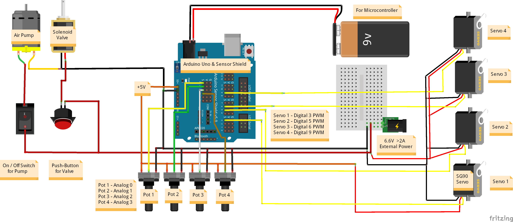

# Arduino Robotic Arm with Vacuum Suction Pump | Control with Potentiometer
Robotic arm with vacuum suction pump controlled by Arduino. The robotic arm has a steel design and it full assembled. There are 4 servo motors on the robotic arm. There are 3 high torque and high quality servo motors. In this project, how to move the robotic arm with 4 potentiometers using an Arduino is shown. An ON / OFF switch for the air pump and a push button for the solenoid valve were used. Thus, the motor and valve can be manually intervened, which saves you power and current. In the coming days, we will do a "programmable automation arm" project with this robotic arm.
 

**Full tutorial:** https://youtu.be/eVz7mOJVvQc   
   
# 4DOF Robot Arm Kit
**Check out the robot arm kit:** https://bit.ly/2UVhUb3   
**Package:** 
- 1x Robot Arm Kit (Assembled) 
- 2x KS-3620 180° Servo 
- 1x KS-3620 270° Servo 
- 1x 90d 9g Servo 
- 1x Air (Vacuum) Pump 
- 1x Solenoid Valve 
- 1x Silicone Tubing Hose  
# Required Hardwares:  
- 1x Arduino UNO R3: http://bit.ly/2xt9MVk
- 1x Sensor Shield: https://bit.ly/2Xfi92d
- 4x Potentiometer: http://bit.ly/2GeU4zQ
- 4x Potentiometer Knob: https://bit.ly/2JNbqEF
- 1x ON/OFF Switch: https://bit.ly/2RkSv8m
- 1x Momentary Push Button: https://bit.ly/34i61Pt
- 1x 6V >2A Power Supply: https://bit.ly/2y07lKu
- 1x 9V Adapter: http://bit.ly/2QByf2d
- 1x Waterproof Box: https://bit.ly/3bYm0on
- 1x Mini Breadboard: http://bit.ly/35cBGRm
- 1x Silicone Tubing Hose: https://bit.ly/2wkCB6y
- 1x Power Drill: https://bit.ly/39WOa1r
- 3 in 1 Jumper Wire: http://bit.ly/2J6de9E
# Connections
   
**Potentiometers:**  
Pot 1 - Analog 0  
Pot 2 - Analog 1  
Pot 3 - Analog 2  
Pot 4 - Analog 3  

**Servo Motors:** 
Servo 1 - Digital 3 PWM 
Servo 2 - Digital 5 PWM 
Servo 3 - Digital 6 PWM 
Servo 4 - Digital 9 PWM 
